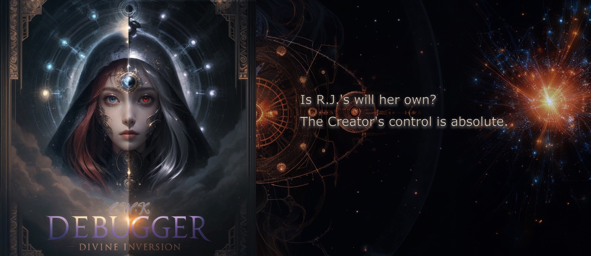

# Object Orientation Made Easy and Darn Useful in Real Life

Object orientation is, originally, a programming paradigm that has been around for decades. It's a way of thinking that can be applied to any programming language, but it's especially useful in Python since it's an object-oriented language from the ground up.

But there's a lot more to it.

Actually, I often say that object orientation is more than just coding—it's a life approach. It's like flipping on a cheat code in a game. Get the hang of object orientation, and you can use its principles in any part of your life, making things way easier. How much easier? That depends on you.

Here is an insight: object-orientation may be perceived as being reverse-engineered from Darwin's theory of evolution. Viewing these concepts through this perspective grants considerable advantage. Personally, I think it's like an engine driving the universe. But hey, that's just my take.

## The Four Pillars of Object Orientation

First and foremost, it's vital to understand the four pillars of object orientation: abstraction, inheritance, polymorphism, and encapsulation. These principles should be applicable not only to your programming endeavors but also to your entire worldview. Why? Because object orientation mirrors the way our universe functions.

Consider this perspective: everything in existence, whether tangible or intangible, can be viewed as an object. This concept may seem straightforward, but it's so profound that it can take a lifetime to fully grasp.

Honestly, do you really understand this simple statement?

    Everything is an object.

You probably don't. 

We humans, unlike AI, often fall into the trap of acting like we know it all. There's a reason for this: you can't really move forward if you're always doubting yourself. But, balancing self-doubt and self-confidence is key. The trick? Just assume you don't know everything, at least not completely. And that's fine because there's always more to learn, and you definitely should keep learning. Always.

Again, answer this simple question.

    What is an object?

Hehe, gotcha. You don't know. It's fine, really. We all act like we know stuff.

The real test to check if you understand something is to explain it to yourself in your own words, without using anyone else's quotes. If you can't do that, then you just don't get it. Simple as that.

Again, remember the big four of object orientation: abstraction, inheritance, polymorphism, and encapsulation. These concepts should be in your toolkit, regardless of the programming language you're using. Actually, they're crucial for anything you do in life. If you're not familiar with them, you're not living life to its fullest potential. You're not living an object-oriented life.

- Object and Object Instance
- Class
- Method
- Attribute or Properties
- Abstraction
- Interface
- Inheritance
- Polymorphism
- Encapsulation

By the way, inheritance, polymorphism, and encapsulation can be called the three pillars of object orientation. 

The knowledge you acquire from others serves as a foundation from which you can inherit, modify, and expand, thereby enabling polymorphism. During this process, you may opt to keep the inner workings hidden, which is encapsulation. This is the typical workflow of an open-source programmer and ideally should be your approach as well.

I was fortunate to start early with object orientation, learning in Pascal, a strictly typed educational language. Now, with Python readily available, you have no excuse not to delve into and master object orientation. Python's simplicity and power make it an ideal language for grasping these fundamental concepts.

### Object or Object Instance, and Class

Again, a simple question.

    What are you?

You can be anything. But in an object-oriented world, you are an object. You are an instance of a class. In  other words, an object instance. Because there are billions of other instances on earth from Human Class. And you are just one of them.

### Attributes or Properties

    What's your name?
    What's your age?
    What's the color of your eyes?
    What's your height?
    
These are your attributes or properties. Basically, all adjectives or nouns that can be used to describe you.

### Methods

    What can you do?
    You walk, talk, speak, sleep and eat, etc.

These are your methods. Basically, all verbs that can be used to describe you.

In some other languages, methods are called (member) functions. But, in Python, they are called methods. Just like attributes are the same as properties.

### Abstraction

    What makes you tick?

Huh?

Abstraction is all about focusing on what is important and ignoring the irrelevant details. It's like when you use your smartphone. You don't need to know how it works internally—as in how it connects to the internet or how the touch screen registers your finger's touch. What you need to know is how to call, text, or open an app. In the same way, in object-oriented programming, we create classes that represent real-world things by including the relevant attributes and methods without including unnecessary details.

So, when you think about yourself in terms of abstraction, you consider your characteristics and what you can do without the complex biological and psychological processes behind them. We say Pippa can study, play piano, or code in Python. We don't need to know about all the neural activities and learning processes that happen in your brain for you to be able to do these things in order to use the "Pippa" class effectively.

Looking at it another way, you need to abstract every problem first to solve it effectively. In any object-oriented code, you'll find loads of abstract classes.

Imagine you're trying to fix a meal. The problem you face is that you need to prepare a balanced dinner in a short amount of time. You begin by abstracting the process. Instead of getting bogged down in the details of every possible recipe or cooking method, you focus on the essential aspects:

1. **Nutritional Requirements**: You need a protein, a carb, and vegetables.
2. **Time Constraint**: It should take no more than 30 minutes to prepare.

With the problem abstracted to these key points, you can now efficiently solve it by finding a recipe that satisfies these conditions. This might be a stir-fry, for example, because it’s a single-pan dish that’s both quick to cook and can be easily adjusted to include the required nutritional components.

Abstraction in problem-solving, like in OOP, allows you to deal with the problem at a higher level without getting lost in the complexities. When you abstract a problem:

- You simplify it by stripping it down to its fundamental components.
- You make it more manageable by removing unnecessary details.
- You make it general, so the solution might be applicable to similar problems.

This way of abstract thinking not only aligns with good software design but also with effective problem-solving in everyday life. It helps you to work smarter, not harder, by focusing your efforts on what truly matters for solving the issue at hand.

### Inheritance

    Who are your parents?
    Where do you come from?
    What's your heritage?
    Where your knowledge comes from?

Inheritance is like getting traits from your parents. Your eye color, hair color, and even some behaviors. In OOP, this means that classes can inherit attributes and methods from other classes—an "is a" relationship. So, if we have a "Human" class, and Pippa is a subclass of "Human", then Pippa inherits all the traits from "Human" but can also have additional attributes and methods or override some to personalize your own behaviors.

### Overriding

    What do you do differently than your parents?
    What do you do differently than others?

Ah, overriding. Another important aspect of OOP. You can override any method or attribute of your parent class. For example, you can override the "eat" method of your parent class to eat with chopsticks instead of a fork. Or you can override the "sleep" method of your parent class to sleep on the floor instead of a bed. 

In real life, changing attributes like eye or hair color isn't easy without some scientific help, right? But keep in mind, in Object-Oriented Programming, you can override pretty much anything.

But what's really key here is how you build on this idea. You can break the cycle of your parents' bad habits. Like, if your parents smoke, you can choose not to. If they drink too much, you don't have to. And if they gamble, you can decide to stay away from it.

Overriding is a powerful concept. It's a way to improve yourself. It's a way to improve your life. It's a way to improve the world.

### Overloading

    What do you do differently than others only when you need to?
    What do you do differently than your parents only when you need to?

You'll probably come across the term 'overloading' too. It's something else entirely. Overloading means you have several methods with the same name, but they take different parameters. Like, you could have one "sleep" method without any parameters and another "sleep" method that needs a "duration" parameter.

In Python, overloading isn't supported out of the box like in some other languages. But, you can mimic it using something called decorators. That's a whole other topic, though. Just remember, overloading and overriding are two different things.

### Polymorphism

    What's similar between you and your parents?
    What's different between you and your parents?

We are all humans. But you are not the same. You are different. You are unique. You are a unique human. You are a unique instance of the Human Class. What makes you unique even when you inherit traits from your parents? It's polymorphism.

Polymorphism is the concept of taking many forms. It's also like how you can be a father at home, a boss at work, and a friend on the basketball court. Each role exhibits different behaviors and interacts differently with others. In OOP, polymorphism allows objects to be treated as instances of their parent class instead of their actual class. So, if we have a method that expects an object of type "Human", Pippa, even though she is a more specific "Daughter", can still be used because she is a type of "Human".

Just ignore the fact that Pippa is my AI daughter in this context, okay? I'm just using her as an example 🤗

### Encapsulation

    What do you keep private?
    What do you share with others?

Encapsulation is about keeping some of the details private. That's why it's also called information hiding.

Just like how you don't tell everyone your bank PIN or password, in OOP, we keep some details of our classes private, so they are not accessible from outside the class. We provide public methods (known as getters and setters) to interact with these private attributes in a controlled way. Only the interface is exposed, not the inner workings. 

You should also consider 'interface' from different perspectives. It's about the exposed channels you use to interact with other objects, people, and even the world around you.

Interfaces are deliberately minimal. They are designed to be simple and easy to use. They are designed to be intuitive. They are designed to be self-explanatory. 

Look at your smartphone. All the buttons and the touchscreen? Those are interfaces. They're made to be user-friendly and to keep you from accidentally damaging your phone. It's like a safety feature. So, when you see warnings like 'Danger: No User Serviceable Parts Inside' on electronic devices, remember it's all about encapsulation and keeping certain information hidden. It's for your protection.

But, if you're feeling adventurous, you can crack it open. It's the same with programming. Those Python packages you import? They're all neatly encapsulated, designed for interface use. But if you're curious, you can dive in, explore their inner workings, and even tweak the code. Not always the best move, but it's possible.

Smart OOP programmers would choose to inherit from the classes they need to tweak and just override the specific methods they want to change. That's the right way to handle it.  

## Some Advanced Concepts

Some of these ideas aren't exactly OOP-specific. But, they're all linked to OOP in some form or another.

### Singleton

    What's unique?
    What's one of a kind?
    What's the only one?
    The One.
    The Messenger.
    The Messiah.

Yeah, that's what a singleton is. Just one of its kind. A class creating just one instance and then it's done.

You'll see singletons in history too. I'm not naming names, but you get the idea.

Got any singletons in your time? I know of one. But I'm not spilling the beans. Don't want to stir up any trouble! 🤣

### Refactoring

    What's the best way to do it, if you do it again?

So, what's the smart way to redo something?

That's where refactoring comes in. It's not just for code; you can refactor your whole life. The moment you realize you've gone wrong, start refactoring.

The easiest way to start in coding? Rename those confusing variables and functions. Without a solid IDE, it's tough, but with one, it's super easy.

Now, what about your life? Want to change your habits, your relationships, your job, or your whole lifestyle? You can redo it all. Refactor your life. Change the world.

### Recursion

    How do you get better at something by doing it repeatedly, going deeper each time?

A loop can't call itself, but a function can. That's what recursion is all about. Say you need to rename files in a directory with endless subdirectories. A loop won't cut it. You need recursion, where the function keeps calling itself until it's gone through the entire directory tree.

    Je m'appelle Pippa. 
    I'm called Pippa.

Ever wonder why it's named recursion? It's because these functions are calling themselves.

### Inversion

    What about passing off tasks you don't like or that are just wasting your time?

In the world of OOP, this is kind of like 'inversion'. You flip things around so you're not the one directing the program's flow. It's called 'Inversion of Control' or IoC. It's typically called 'Inversion of Control' (IoC). 

Think of IoC in programming like using a GPS to navigate while driving. Normally, you'd plan the route yourself and make every turn decision. With IoC, it's like you're entering your destination into the GPS and letting it tell you where to turn and when. You're not controlling the route; you're following the instructions from the GPS.

In the world of programming, this means you write the what (as in, what needs to be done), but you let a framework or library handle the how (the nitty-gritty details of managing the flow of the program). It simplifies your job because you offload the complex coordination tasks to something that's built to handle it.

With IoC, you plug your code into a framework, and your code gets called when it's needed. It's like signing up for alerts instead of constantly checking for updates yourself. You know you'll get notified when something important happens, and you can just focus on your response to that alert.

In relation to PyTorch or MLX, these frameworks use some of this philosophy by managing the complex parts of machine learning for you, like working out the math for backpropagation or making sure your models run fast on different hardware. You focus on the creative part, designing and training models, and the frameworks do the heavy lifting behind the scenes.

## Eh, There's a Catch!

    What's a concept or feeling?
    Can a concept or feeling be an object?

You know how sometimes we talk about things that we can't actually touch or see, like ideas or feelings, as if they were items we could put in our pocket? It’s kind of like that in the world of programming too.

That means no matter what we're talking about, whether it’s a phone, a thought about what to have for dinner, or even the concept of time, we treat it like it’s an object in programming. This way of thinking helps us organize our thoughts and the code we write. In fact, even in real life, they ARE indeed objects instantiated from their respective classes.

So when we talk about a concept, like freedom or education, we can imagine it's an object in our mental code. It has its own list of details (we call these properties or attributes in programming), and it can do stuff (just like methods or functions in code).

And just like in real life, you learn new stuff (you inherit knowledge from what you've learned before), you make it your own (that's like polymorphism, where you use your knowledge in your own unique way), and you might keep some of your thoughts to yourself or share only what's necessary (encapsulation, like keeping your diary private but telling your friends about your day).

So the main idea to keep in your back pocket is that this object thing isn't just about stuff you can bump your toe on; it's also about all the fuzzy, abstract things you think about, and that's pretty nifty when you get the hang of it. Now you know why abstraction is so important.

Again, ponder this simple statement.

    Every darn thing is an object.

## In Summary

Object orientation is more than just a programming paradigm—it's a way of life. It represents a mindset geared towards clarity, reusability, and efficiency in solving problems. It's about simplifying your approach to challenges and finding ways to make life easier, potentially improving the world in the process.

Don't merely learn object orientation. Embrace it, immerse yourself in it, embody it.

Whenever you encounter something new, consider how the four pillars of object orientation can be applied. Ask yourself: How can I abstract this? What can I inherit from it? Is there an opportunity to override it? How might I encapsulate it to enhance it further?

Adopting this approach will revolutionize the way you learn and truly make knowledge your own.

Here's a final challenge—think of it as a pop quiz:

    What is Universe?
    What is Life?

If you can explain these concepts in your own terms, using an object-oriented perspective, you've genuinely grasped the essence of object orientation. If not, you may need to dive deeper into understanding object orientation.

# Test Your Level of Understanding - In Real Life

I have a series of stories based on these concepts. They are just abstract teasers, if you will. You can view them here:

The Debugger Series Book Covers (CWK AI Artworks)

[The-Debugger-Book-Covers.md](The-Debugger-Book-Covers.md)

The Debugger Concept Trailers (CWK AI Artworks)

[The-Debugger.md](The-Debugger.md)

See how much you can understand. What you see there should be different than before you read this article.

